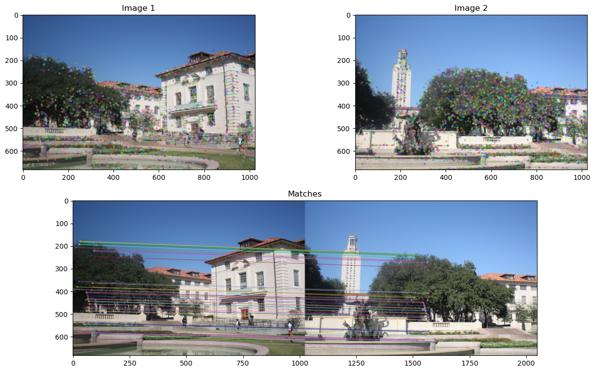
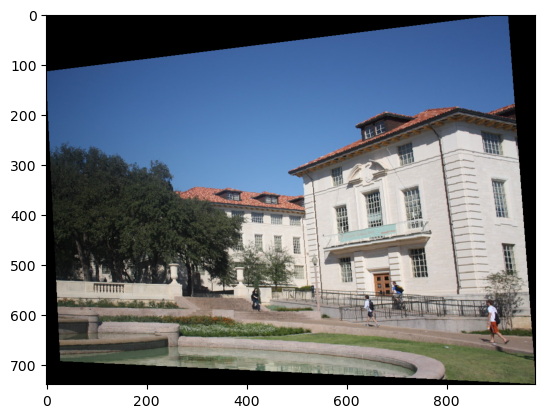
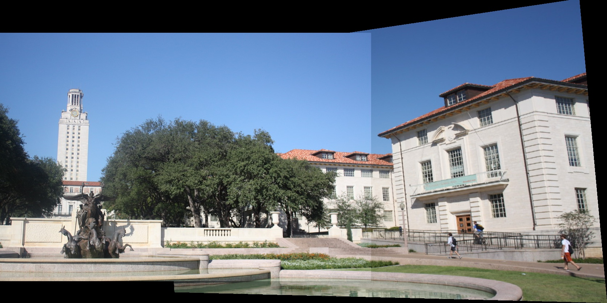

# Image Stitching

A manual implementation of an image stitcher that uses image warping and homographies to automatically create an image mosaic. We will focus on the case where we have two input images that should form the mosaic, where we warp one image into the plane of the second image and display the combined view.

This project was developed as part of the course Computer Vision in the Fall 2022 semester at the Faculty of Engineering, Alexandria University, under the Computer and Communications Engineering department, supervised by Dr. Marwan Torki.

## Steps

1- Getting correspondences and computing the homography parameters



2- Warping between image planes using homography matrix



3- Create the output mosaic



## Prerequisites

This project was developed in the following environment:

- Jupyter Notebook
- Miniconda
- Python 3.11.5

## Installing

1- Clone the repository to your local machine:

```bash
git clone https://github.com/MohEsmail143/image-stitching.git
```

2- Open Jupyter notebook.

3- Check out the the Jupyter notebooks `image_stitching.ipynb`.

## License

This project is licensed under the MIT License - see the [LICENSE.md](LICENSE) file for details.
